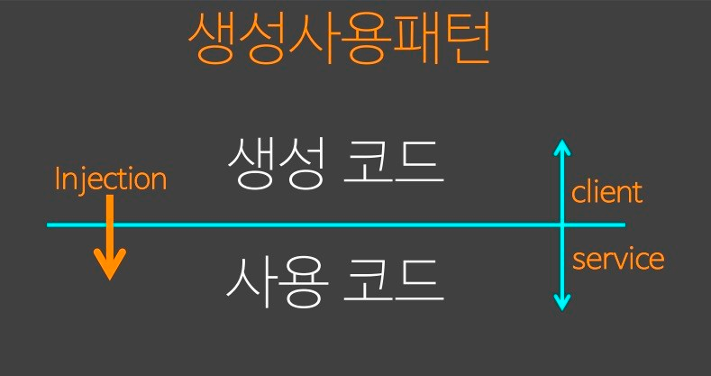

# 1장 오브젝트와 의존관계

## 1.1 초난감 DAO

> DAO:  Data Access Object, 데이터베이스를 사용해 데이터를 조회하거나 조작하는 기능을 위한 오브젝트

### 1.1.1 User

> Bean
>
> - 디폴트 생성자: 툴이나 프레임워크에서 리플렉션을 이용해서 오브젝트를 만들기 때문에 필요하다.
> - 프로퍼티: 자바 빈이 노출하는 이름을 가진 속성, setter/getter 메소드를 통해 접근한다.

### 1.1.2 UserDao

JDBC API 사용 방법을 따라 만든 DAO

### 1.1.3 main()을 이용한 DAO 테스트 코드

동작은 한다.

문제점은 무엇일까?

`분리와 확장`을 다루게 된다.

## 1.2 DAO의 분리

### 1.2.1 관심사의 분리

### 1.2.2 커넥션 만들기의 추출

#### UserDao의 관심사항

- DB 연결을 위한 Connection 오브젝트를 가져오는 코드가 add()와 get() 메서드에 담겨있다.
- 심지어 코드가 중복되어 있다.
- 리소스를 반환하지 않는 등의 예외처리가 없다.

#### 중복 코드의 메서드 추출

- getConnection() 메서드를 추출한다.

### 1.2.3 DB 커넥션 만들기의 독립

#### 상속을 통한 확장

- 템플릿 메서드 패턴(template method pattern),팩토리 메서드 패턴(factory method pattern)을 이용한다.

## 1.3 DAO의 확장

- UserDao의 코드는 유지하면서 확장이 가능해졌다.

### 1.3.1 클래스의 분리

- 구체 클래스에 의존한 코드이다.

### 1.3.2 인터페이스의 도입

- 기존의 코드를 추상화에 의존하도록 변경
- 초기에 한 번 생성자의 코드가 제거 되지 않고 남는다.

### 1.3.3 관계설정 책임의 분리

- 오브젝트 사이의 관계는 런타임 시에 한쪽이 다른 오브젝트의 레퍼런스를 갖고 있는 방식으로 만들어진다.
  - `포인터의 포인터 방식`

- `생성 사용 패턴`

### 1.3.4 원칙과 패턴

#### 개방 폐쇄 원칙, OCP(Open-Closed Principle)

#### 높은 응집도와 낮은 결합도

#### 전략 패턴

## 1.4 제어의 역전(IoC)

### 1.4.1 오브젝트 팩토리

### 1.4.2 오브젝트 팩토리의 활용

### 1.4.3 제어권의 이전을 통한 제어관계 역전

- 제어의 역전
  - 모든 제어권을 자신이 아닌 다른 대상에게 위임하는 것

## 1.5 스프링의 IoC

### 1.5.1 오브젝트 팩토리를 이용한 스프링 IoC

#### 애플리케이션 컨텍스트와 설정정보

스프링에서는 빈의 생성과 관계설정 같은 제어를 담당하는 IoC 오브젝트를 빈 팩토리라고 부른다.

빈 팩토리보다는 이를 좀 더 확장한 애플리케이션 컨텍스트를 주로 사용한다.

애플리케이션 컨텍스트는 IoC 방식을 따라 만들어진 일종의 빈 팩토리이다.

애플리케이션 컨텍스트는 "별도의 정보"를 참고해서 빈의 생성, 관계설정 등의 제어 작업을 총괄한다.

#### DaoFactory를 사용하는 애플리케이션 컨텍스트

### 1.5.2 애플리케이션 컨텍스트의 동작방식

스프링에서는 애플리케이션 컨텍스트를 IoC 컨테이너, 스프링 컨테이너라고 부른다.

애플리케이션 컨텍스트는 빈 팩토리의 기능을 상속받아 만들어져 있어서, 빈 팩토리 라고도 부른다.

애플리케이션 컨텍스트는 애플리케이션에서 IoC를 적용해서 관리할 모든 오브젝트에 대한 생성과 관계설정을 담당한다.

애플리케이션 컨텍스트는 `@Configuration`이 붙은 자바 클래스를 설정정보로 등록해두고, `@Bean`이 붙은 메서드의 이름을 가져와 빈 목록을 만들어둔다.

클라이언트가 애플리케이션 컨텍스트의 getBean() 메서드를 호출하면 자신의 빈 목록에서 요청한 이름이 있는지 찾고, 있다면 빈을 생성하는 메서드를 호출해서 오브젝트를 생성시킨
후 클라이언트에 돌려준다.

- 애플리케이션 컨텍스트를 사용했을 때 얻을 수 있는 장점
  - 클라이언트는 구체적인 팩토리 클래스를 알 필요가 없다
    - XML 처럼 단순한 방식도 사용할 수 있다.
  - 애플리케이션 컨텍스트는 종합 IoC 서비스를 제공해준다
  - 애플리케이션 컨텍스트는 빈을 검색하는 다양한 방법을 제공한다

### 1.5.3 스프링 IoC의 용어 정리

#### 빈

스프링이 IoC 방식으로 관리하는 오브젝트

#### 빈 팩토리

빈을 생성하고 관계설정을 총괄하는 IoC 컨테이너

#### 애플리케이션 컨텍스트

빈 팩토리를 확장한(상속받은) IoC 컨테이너

#### 설정정보/설정 메타정보

애플리케이션 컨텍스트 또는 빈 팩토리가 IoC를 적용하기 위해 사용하는 메타정보

애플리케이션의 형상 정보, 청사진

#### IoC 컨테이너

IoC 방식으로 빈을 관리한다

## 1.6 싱글톤 레지스트리와 오브젝트 스코프

스프링은 여러 번에 걸쳐 빈을 요청하더라도 매번 동일한 오브젝트를 돌려준다.

> 오브젝트의 동일성과 동등성
>
> 동일성은 `==` 연산자로 비교한다
> 동등성은 `equals()` 메서드로 비교한다

### 1.6.1 싱글톤 레지스트리로서의 애플리케이션 컨텍스트

#### 싱글톤 패턴의 한계

- private 생성자를 가지고 있기 때문에 상속할 수 없다
- 싱글톤은 테스트하기가 힘들다
- 서버환경에서는 싱글톤이 하나만 만들어지는 것을 보장하지 못한다
- 싱글톤의 사용은 전역 상태를 만들 수 있다

#### 싱글톤 레지스트리

스프링은 싱글톤 형태의 오브젝트를 만들고 관리하는 기능을 제공한다.

### 1.6.2 싱글톤과 오브젝트의 상태

싱글톤이 멀티스레드 환경에서 서비스 형태의 오브젝트로 사용되는 경우 상태정보를 내부에 갖고있지 않은 무상태 방식으로 만들어져야 한다.

### 1.6.3 스프링 빈의 스코프

빈이 생성되고 존재하고 적용되는 범위

10장에서 배운다.

## 1.7 의존관계 주입(DI)

### 1.7.1 제어의 역전(IoC)와 의존관계 주입(DI)

IoC 방식의 핵심은 의존관계 주입이다.

### 1.7.2 런타임 의존관계 설정

의존은 의존 대상이 변하면 그 영향이 전파되는 관계를 의미한다.

DI 컨테이너는 런타임 시에 메서드(생성자)의 파라미터로 오브젝트의 레퍼런스를 전달한다.

이를 의존관계 주입이라 한다.

### 1.7.3 의존관계 검색과 주입

의존관계 검색보다는 의존관계 주입이 훨씬 단순하고 깔끔하다.

DI를 원하는 오브젝트는 빈이어야한다.

### 1.7.4 의존관계 주입의 응용

코드에는 런타임 클래스에 대한 의존관계가 나타나지 않고, 인터페이스를 통해 결합도가 낮은 코드가 된다.

변경을 통한 다양한 확장이 가능하다.

DI의 장점은 관심사의 분리 SoC를 통해 얻어지는 높은 응집도에서 나온다.

### 1.7.5 메서드를 이용한 의존관계 주입

- 수정자 메서드(setter)를 이용한 주입
- 일반 메서드를 이용한 주입

## 1.8 XML을 이용한 설정

### 1.8.1 XML 설정

### 1.8.2 XML을 이용하는 애플리케이션 컨텍스트

### 1.8.3 DataSource 인터페이스로 변환

### 1.8.4 프로퍼티 값의 주입

## 1.9 정리
