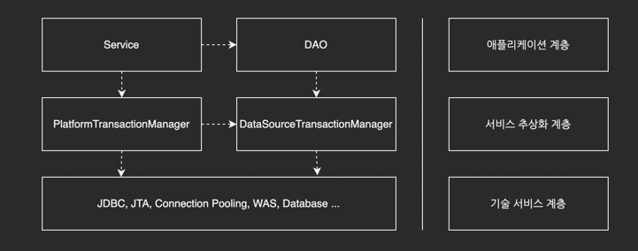

# 서비스 추상화

## 5.1 사용자 레벨 관리 기능 추가

UserDao를 다수의 회원이 가입할 수 있는 인터넷 서비스의 사용자 관리 모듈에 적용한다.

사용자 관리 기능에는 정기적으로 사용자의 활동내역을 참고해서 레벨을 조정해주는 기능이 필요하다.

## 5.2 트랜잭션 서비스 추상화

### 5.2.1 모 아니면 도
트랜잭션이란 더 이상 나눌 수 없는 단위 작업을 말한다.

중간에 예외가 발생해서 작업을 완료할 수 없다면 아예 작업이 시작되지 않은 것 처럼 초기 상태로 돌려놔야 한다.

### 5.2.2 트랜잭션 경계설정

모든 트랜잭션은 시작하는 지점과 끝나는 지점이 있다.

시작하는 방법은 한 가지이지만 끝나는 방법은 두 가지다.

모든 작업을 무효화하는 롤백과 모든 작업을 다 확정하는 커밋이다.

트랜잭션의 경계설정을 비즈니스 로직 내로 옮겨야한다.

#### 비즈니스로직 내 트랜잭션 경계설정의 문제점

- DB 커넥션을 비롯한 리소스의 깔끔한 처리를 가능하게 했던 JdbcTemplate을 더 이상 활용할 수 없다.
- DAO의 메서드와 비즈니스로직의 메서드에 Connection 파라미터가 추가 되어야 한다.
  - 멀티스레드 환경에서는 공유하는 인스턴스 변수에 스레드별로 생성하는 정보를 저장하다가는 서로 덮어쓰는 일이 발생한다.
- Connection 파라미터가 DAO 메서드에 추가되면 더이상 데이터 액세스 기술에 독립적일 수 없게 된다.

### 5.2.3 트랜잭션 동기화

#### 스프링의 트랜잭션 동기화 기능

- 비즈니스 로직에서 Connection을 생성하고
- 이를 트랜잭션 동기화 저장소에 저장해두고 Connection의 `setAutoCommit(false)`를 호출해 트랜잭션을 시작시킨후 DAO의 기능을 이용
- 비즈니스 로직의 메서드가 호출되고, 메서드 내부에서 사용하는 트랜잭션 동기화 저장소에서 현재 시작된 트랜잭션을 가진 Connection 오브젝트가 존재하는지 확인한다.
- Connection을 발견하고 이를 가져온다
- Connection을 이용해 PreparedStatement를 만들어 SQL을 실행한다. 트랜잭션 동기화 저장소에서 DB 커넥션을 가져왔을 때는 JdbcTemplate은 Connection을 닫지 않은채로 작업을 마친다
- 이후의 메서드 호출들이 진행되는 동안 Connection은 열려 있고 트랜잭션은 진행중인 채로 트랜잭션 동기화 저장소에 저장되어있다
- 트랜잭션 내의 모든 작업이 정상적으로 끝났으면 비즈니스 로직은 커넥션의 `commit()`을 호출해서 트랜잭션을 완료시킨다
- 트랜잭션 저장소가 더 이상 Connection 오브젝트를 저장해두지 않도록 제거한다.
  - 어느 작업중이라도 예외상황이 발생하면 비즈니스 로직은 Connection의 `rollback()`을 호출하고 트랜잭션을 종료한다.

### 5.2.4 트랜잭션 서비스 추상화

#### 기술과 환경에 종속되는 트랜잭션 경계설정 코드

자바는 JDBC 외에 글로벌 트랜잭션을 지원하는 트랜잭션 매니저를 JTA(Java Transaction API)통해 지원한다.

#### 스프링의 트랜잭션 서비스 추상화

https://docs.spring.io/spring-framework/docs/current/reference/html/data-access.html#transaction-strategies

전략 패턴으로 구성되어 있다.

## 5.3 서비스 추상화와 단일 책임 원칙

DAO와 비즈니스 로직을 분리하는 것은 각각 담당하는 코드의 기능적인 관심에 따라 분리되고 서로 불필요한 영향을 주지 않으면서 독자적으로 확장이 가능하도록 만든 것이다.

이는 같은 애플리케이션 로직을 담은 코드지만 내용에 따라 분리했다.

같은 계층에서 수평적인 분리라고 볼 수 있다.

하지만 트랜잭션 추상화는 이와는 좀 다르다.

애플리케이션의 비즈니스 로직과 그 하위에서 동작하는 로우레벨의 트랜잭션 기술이라는 다른 계층의 특성을 갖는 코드를 분리한 것이다.

스프링의 DI는 애플리케이션 로직의 종류에 따른 수평적, 로직과 기술이라는 수직적 구분이든 결합도가 낮은 구조를 만들 수 있게 한다.

#### 단일 책임 원칙

하나의 모듈은 한 가지 책임을 가져야 한다.

하나의 모듈이 바뀌는 이유는 한 가지여야 한다.

변경이 필요할 때 수정 대상이 명확해진다.

## 5.4 메일 서비스 추상화

### 5.4.1 JavaMail을 이용한 매일 발송 기능

JavaMail API를 사용하는 메서드를 추가한다.

SMTP 프로토콜을 지원하는 메일 전송 서버가 준비되어 있다면, 문제가 없다

### 5.4.2 JavaMail이 포함된 코드의 테스트

메일 서버가 준비가 안된 상황이라면 어떻게 테스트를 해야할까?

메일 서버로 요청이 잘 전달되는지를 테스트 하면 된다.

### 5.4.3 테스트를 위한 서비스 추상화

스프링이 제공하는 JavaMailSender 인터페이스를 이용한다.

트랜잭션 개념도 적용해야한다.

### 5.4.4 테스트 대역

#### 테스트 대역의 종류와 특징

- 테스트 스텁
- 목 오브젝트

